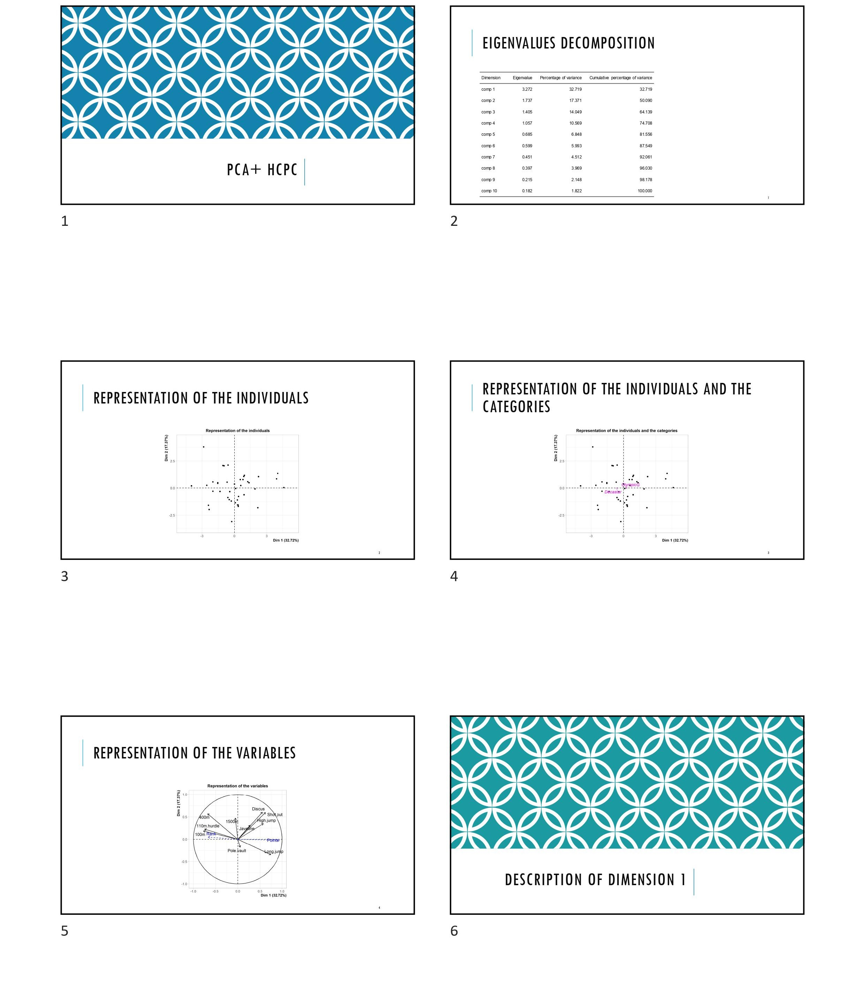
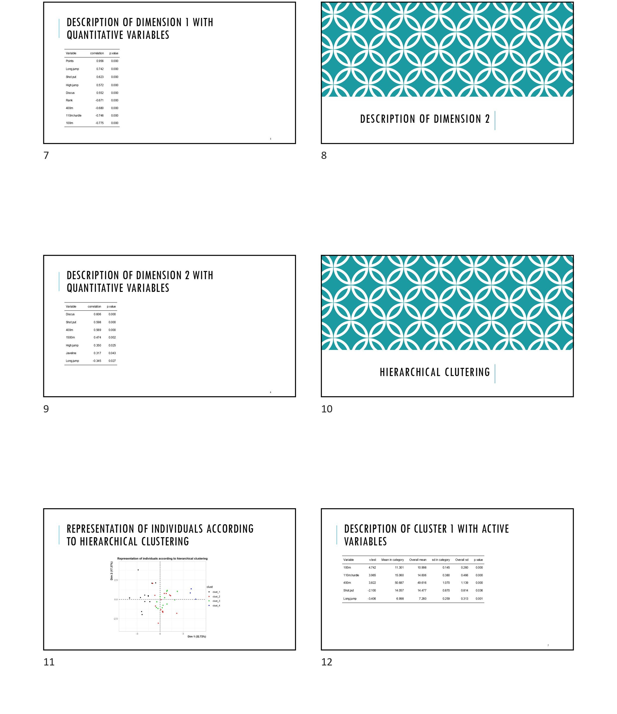
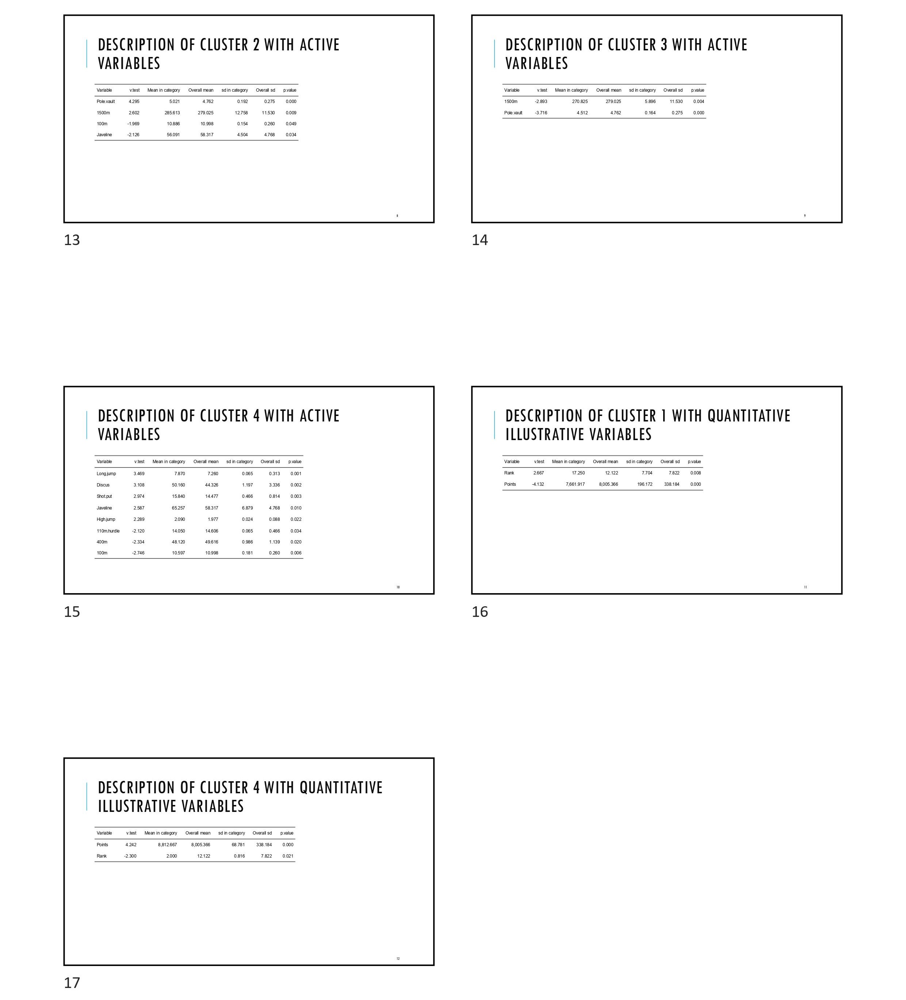

<style>
body {
text-align: justify}
</style>

```{r, include = FALSE}
knitr::opts_chunk$set(
  collapse = TRUE,
  comment = "#>"
)
```

```{r setup}
library(YesSiR)
library(FactoMineR)
library(SensoMineR)
```

`YesSiR` is a package designed to make reporting for some of the most used functions in `FactoMineR` and `SensoMineR` by producing PowerPoint presentation.

## The functions inputs

All the functions of the YesSiR package used for reporting (`Yes_MCA`, `Yes_PCA`, `Yes_decat`, `Yes_texual`) share inputs. These inputs are:

* res
* yes_study_name
* path
* file.name
* size_tab
* proba

Let's describes each of them from top to bottom.
<br><br />

First, the **res** parameter takes as input the object resulting from the analysis you wish to produce a reporting from.  `Yes_MCA` takes the result of a MCA, `Yes_decat` takes the result of a decat (a function of SensoMineR), etc.  
The **yes_study_name** takes as input a string containing the title of the first slide of the PowerPoint presentation.  
The **path** argument is used to indicate the path to the directory you want the PowerPoint file to be stored. By default, **path** is set to the current working directory.  
The **file.name** argument is pretty straightforward: it is the name you want to give to the generated file. However, don't forget to include the ".pptx" extension in the name, otherwise an error will be produced. For instance, if you want your file name to be "myFile" then you set `file.name="myFile.pptx"`.  
**Size_tab** is used to set the maximum number of rows a table may have per slide.  
Lastly, the **proba** parameter is used to set the significance threshold.
<br><br />

The **x1** and **x2** (in Yes_PCA/MCA/decat) parameters let you choose which dimensions to plot and describe.  
In Yes_decat and Yes_textual, the **col.neg** and **col.pos** arguments set colors for the color gradient applied on the word clouds. By default, these colors are set to redc(for negative values) and blue (for positive values).

## Reporting of a Principal Component Analysis

Since the PCA and MCA functions are very similar, what is shown in this example can be applied to the Yes_MCA function.
First things first, let's compute a PCA:

```{r, chunk1, echo=-1}
options(width = 100)
data(decathlon)
head(decathlon)
res.pca <- PCA(decathlon, quanti.sup = 11:12, quali.sup=13, graph = FALSE)
lapply(res.pca, names)
```

As you can see in the example above, the PCA produces lots of data frames. While it is a good thing to have that many results, analyzing the PCA can quickly become tedious. That is precisely why YesSiR has been developed. From a PCA, Yes_PCA will produce an elegant and structured PowerPoint presentation. For the PCA (and the MCA), the PowerPoint structure is as follow:

* Representation of the individuals (and categories), and representation of the variables
* Description of the selected axes
* Results of the Hierarchical Clustering on Principle Components and describtion of the clusters.  
Let's see now how to use the Yes_PCA function:
```{r eval=FALSE}
Yes_PCA(res = res.pca, path = "C:/YesSiR_examples", file.name = "PCA_example.pptx")
```
In the example above, the function Yes_PCA is used on the result of the previously computed PCA.  
The figure below show the content of the PCA_example.pptx file:
<br><br />
{width=100%}
{width=100%}
{width=100%}

